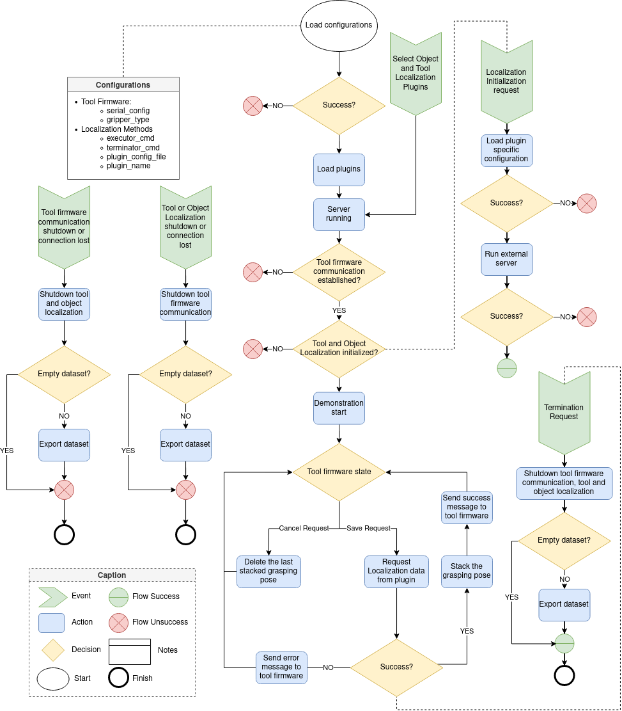

# Mimic grasping API

<a rel="license" href="http://creativecommons.org/licenses/by-nc-nd/4.0/">

* [Overview](#overview)
* [Prerequisites](#prerequisites)
* [Installation](#installation)
* [Usage](#usage)

## <a name="overview"></a>Overview

<p align="center">
  
</p>
<p align="center">
The mimic grasping API flowchart.
</p>

## <a name="prerequisites"></a>Prerequisites

### Essential
* [Simple serial](https://github.com/ItzMeJP/SimpleSerialInterface)
* [Plugin system management](https://github.com/ItzMeJP/plugin_system_cpp)
* [Eigen3](https://eigen.tuxfamily.org/index.php?title=Main_Page)
* [Boost](https://www.boost.org/)
* [Jsoncpp](https://open-source-parsers.github.io/jsoncpp-docs/doxygen/index.html#_intro)

### Complementary

Since the mimic_grasping_api is based on plugin management, the plugins used could have to communicate to a externals applications. Thus, bellow is presented a list of plugins external packages dependencies:

* [Mimic Grasping ROS Interface Package](https://github.com/ItzMeJP/mimic_grasping_ros_interface_package): used by plugins based on object_recognition pipeline;

## <a name="installation"></a>Installation

Setup all prerequisites. Then:
```
cd /mimic_grasping_server
mkdir build
cd build
cmake ..
sudo make install
```

After the installation the shared libs will be located at ```/usr/local/lib```. The headers files will be located at ```/usr/local/include```

## <a name="usage"></a> Usage
TODO

### <a name="configuration"></a> Configuration
### <a name="examples"></a> Use-case examples

-----------------------------------------------------------------------------------------------------------------------------------------------------------------------------------------------------
<br />This work is licensed under a <a rel="license" href="http://creativecommons.org/licenses/by-nc-nd/4.0/">Creative Commons Attribution-NonCommercial-NoDerivatives 4.0 International License</a>.
