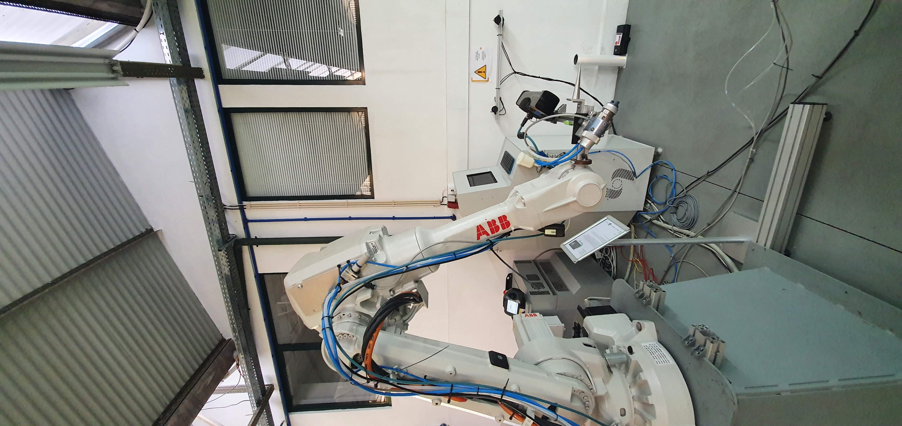
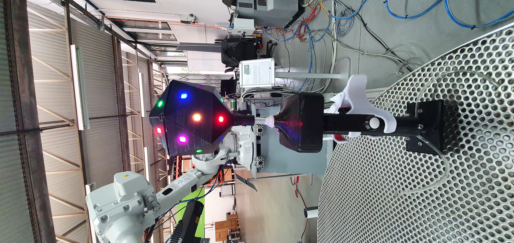
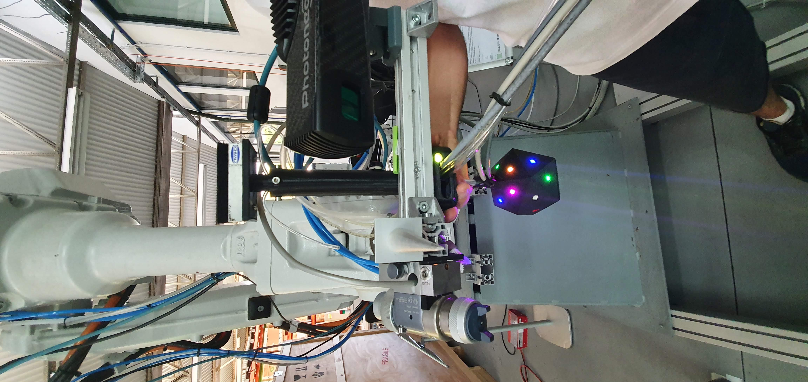

# 6DMimic + OR Calibration

This documents describe how to calibrate the Mimic Grasping use-case using the 6DMimic (with ABB IRB1600 robot) and the OR plugins. For further information , see [João Pedro Souza's thesis]()

## OR Plugin Calibration

1. First calibrate the object detection camera into robot's TCP. See [this](https://github.com/ItzMeJP/calib_camera_external) package to perform this calibration using ChAruco markers.

2. Afterwards, put the Camera at the acquisition pose from the object.

3. Get the transformation between the camera w.r.t. the robot base (transformation matrix which represents the acquisition pose). Therefore, build the ```/configs/{profile}/calib_matrix.json``` file.


## 6DMimic Plugin Calibration

The Lazarus project to calibrate the system can be found [here](https://gitlab.inesctec.pt/CRIIS/mimicgrasping/mimic_grasping_6dmimic_interface) and should be installed into 6D Mimic PC. Therefore:

1. Calibrate the **stereo camera** (see section 3.2 in 6dmimic manual [here](/docs/use_case_6dmimic_OR/6DMimic_User_and_Developer_Manual.pdf)).

2. Into ABB Robot, select the [mimic_grasping program](/docs/use_case_6dmimic_OR/abb_irb_1600_programs). Put the robot into p_calib_marker10 pose (**be aware to the trajectory movement avoiding damage into setup**). Get the tool0 (TCP's frame) w.r.t robot base Rotation Matrix and fill the robotStandBy.rot file (placed inside the "/home/mimic/Projects/6DM-IILAB/6DM/Icosahedron3D/mimic_grasping"). Since its need only the rotation, the robot position can be translated avoiding rotation allowing easy calibration. Currently this matrix is already setup.

<p align="center">
  
</p>
<p align="center">
Robot calibration pose (robot_calib_marker10 in robot program).
</p>

3. Be sure that the tool marker have the following LED distribution:

<p align="center">
  
</p>
<p align="center">
Marker LEDs configuration into mimic tool.
</p>

4. Calibrate the tool. Using the mimic grasping tool and running the /MimigGrasping/Stereo Calib.sh (into 6D Mimic computer) check the camera tab properties : "Ext Trigger" and the "Open Devices". Wait the camera startup, place the marker in front of them and verify if the marker leds are shown in both popup screens. Therefore, start the tool/marker calibration procedure which is defined by two steps:

 - **Defining the horizontal rotation matrix:** place the marker according to the figure below (tool inverted) and select Horizontal Tab>Get>Set. The generated matrix is placed at "/home/mimic/Projects/6DM-IILAB/6DM/Icosahedron3D/mimic_grasping/RotMatrixHoriz.rot". This rotation defines the icosaedron zero pose frame (namely the CAD ref w.r.t TCP0**??need confirmation??**).

 <p align="center">
   
 </p>
 <p align="center">
 Horizontal calibration pose.
 </p>

 - **Defining the tool rotation matrix:** aligns the mimic grasping tool probe tool with the robot TCP0 (more near possible, if need mode robot mantaining the orientation, the init orientation), see Figure below, then select Tool Tab>Get>Set. The generated matrix is placed at "/home/mimic/Projects/6DM-IILAB/6DM/Icosahedron3D/mimic_grasping/RotMatrixTool.rot". This defines the manual tool's tip rotation matrix w.r.t the tcp0.

 <p align="center">
   
 </p>
 <p align="center">
 Tool calibration pose.
 </p>

 **obs:** be sure that the marker is correctly visible. To be sure of that, the debug window should be displaying: the marker pose w.r.t robot frame; the marker sphere radius; the marker rotation w.r.t. tcp0 and the marker rotation w.r.t. robot frame.

5. Define the tip.pnt file (placed inside the "/home/mimic/Projects/6DM-IILAB/6DM/Icosahedron3D/mimic_grasping"). This is the 3D displacement of the Tool Tip w.r.t the robot frame placed (not rotated) in the center of icosaedron zero pose.


6. All these created files (robotStandBy.rot, tip.pnt, RotMatrixHoriz.rot, RotMatrixTool.rot ) must be placed at 6DMimic icosaedron folder inside 6D Mimic computer (namely "/home/mimic/Projects/6DM-IILAB/6DM/Icosahedron3D/mimic_grasping"). Therefore the system can be correctly load the use-case qualibration.

**obs:** The /MimigGrasping/Verify_Calib_With_6DMimic.sh can help verify the calibration using the original 6DMimic procedure.

See doc [error_compensation.md](\error_compensation.md) to understand the error compensation method if needed.
